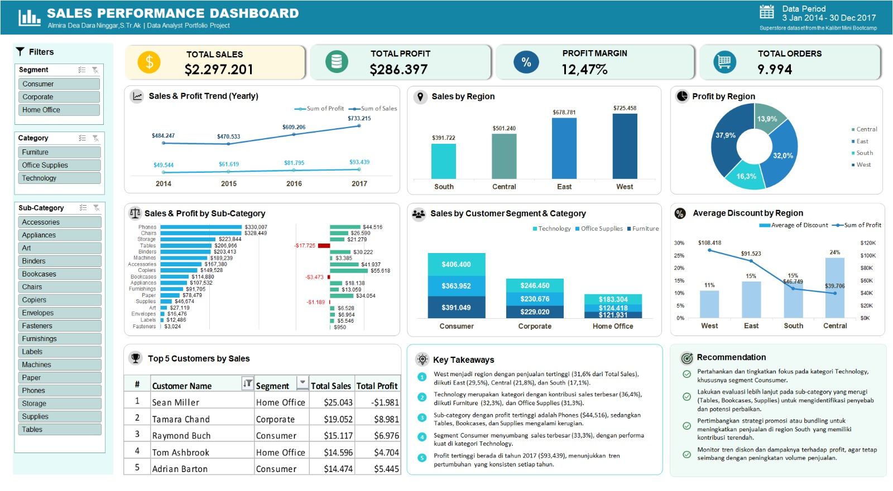

# Excel Sales Performance Dashboard

Dashboard analisis performa penjualan interaktif yang dikembangkan menggunakan Microsoft Excel dengan memanfaatkan dataset Superstore yang diperoleh melalui Mini Bootcamp Kalibrr.

## Deskripsi Proyek

Proyek ini bertujuan untuk menganalisis Sales dan Profit berdasarkan beberapa aspek bisnis, seperti:

- Wilayah penjualan
- Segmen pelanggan
- Kategori dan sub-kategori produk
- Performa pelanggan
- Tren penjualan dan profit dari waktu ke waktu

Hasil analisis disajikan dalam bentuk dashboard interaktif menggunakan PivotTable, PivotChart, Slicer, dan Data Labels.

## Key Metrics

- **Total Sales:** $2,297,201
- **Total Profit:** $286,397
- **Profit Margin:** 12.47%
- **Total Orders:** 9,994

## Fitur Dashboard

Dashboard menyediakan beberapa analisis dan visualisasi, antara lain:

- KPI Total Sales, Total Profit, Profit Margin, dan Total Orders
- Slicer interaktif untuk memfilter data
- Analisis Sales dan Profit berdasarkan Region
- Analisis Sales berdasarkan Customer Segment dan Category
- Analisis Sales dan Profit berdasarkan Sub-Category
- Analisis tren Sales dan Profit berdasarkan tahun
- Analisis Top Customer
- Key Takeaways dan rekomendasi berdasarkan hasil analisis

## Tools yang Digunakan

- Microsoft Excel
- PivotTable
- PivotChart
- Slicer
- Data Labels

## Struktur Repository

```text
Excel-Sales-Performance-Dashboard/
├── README.md
├── Excel-Sales-Performance-Dashboard.xlsx
└── 
    └── dashboard.png
```

## Tujuan Proyek

Proyek ini dibuat sebagai portfolio project untuk menunjukkan kemampuan dalam:

- Melakukan analisis data menggunakan Microsoft Excel
- Mengolah dan merangkum data menggunakan PivotTable
- Membuat visualisasi data menggunakan PivotChart
- Membuat dashboard interaktif menggunakan Slicer
- Menentukan dan menyajikan KPI
- Mengidentifikasi pola dan insight dari data
- Menyajikan hasil analisis dalam bentuk dashboard yang mudah dipahami

## Hasil

Dashboard memberikan gambaran mengenai Sales, Profit, pelanggan, produk, wilayah penjualan, serta tren penjualan berdasarkan data transaksi Superstore.
